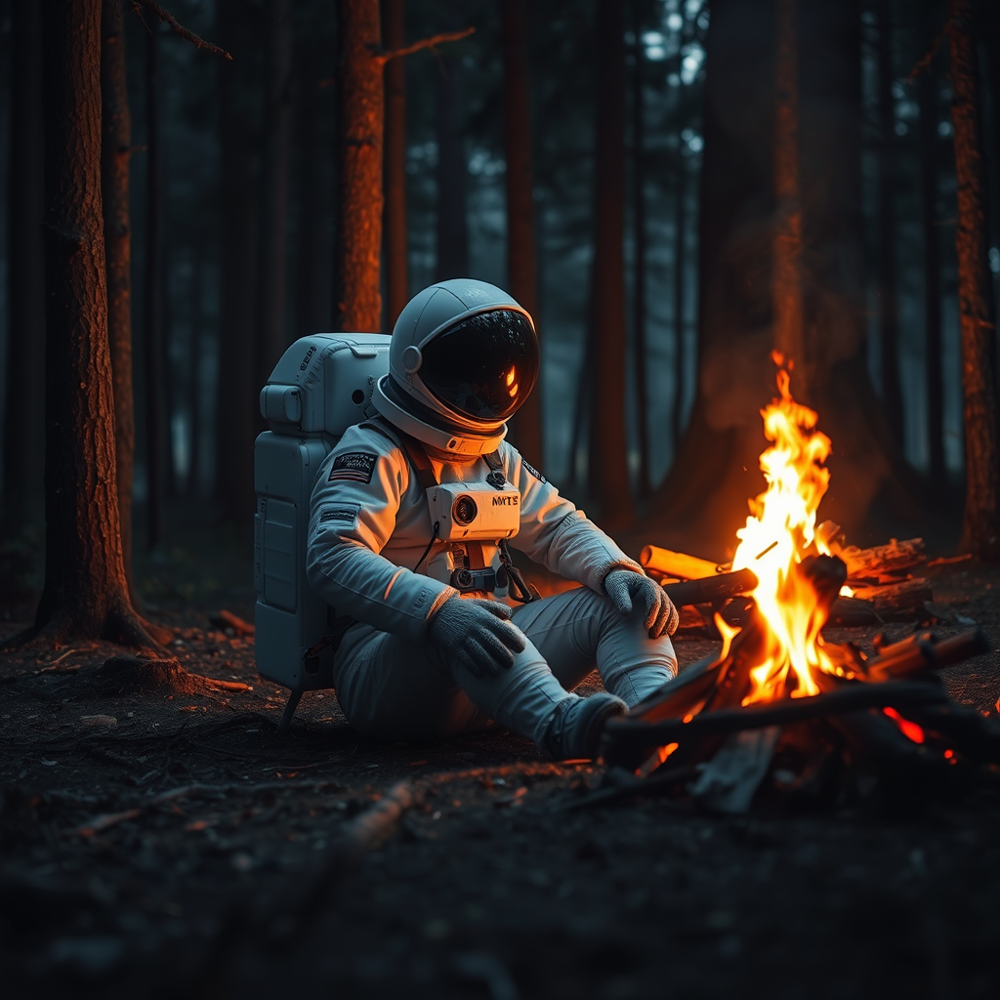

# fancyfeast/joy-caption-pre-alphaCog Model

This is an implementation of [fancyfeast/joy-caption-pre-alpha](https://huggingface.co/spaces/fancyfeast/joy-caption-pre-alpha) as a [Cog](https://github.com/replicate/cog) model.

## Development

Follow the [model pushing guide](https://replicate.com/docs/guides/push-a-model) to push your own model to [Replicate](https://replicate.com).

## Basic Usage

Grab Image Adapter:

    wget https://huggingface.co/spaces/fancyfeast/joy-caption-pre-alpha/resolve/main/wpkklhc6/image_adapter.pt

To run a prediction:

    cog predict -i image=@astro.png

# Input

## Output

    This is a highly detailed, digitally rendered photograph set in a dense forest during twilight. The central subject is a lone astronaut, seated on the forest floor with a campfire in front of them. The astronaut is dressed in a white spacesuit with a reflective helmet, which is adorned with the NASA logo and various patches. The suit appears to be made of a smooth, durable fabric with visible seams and pockets. The astronaut's face is obscured by the helmet's visor, but their gloved hands are visible, resting on their knees.

    The campfire is a vibrant orange-yellow, casting a warm glow on the surroundings and creating stark contrasts with the dark, shadowy forest. The forest is populated by tall, straight trees with rough bark, and the ground is covered in fallen leaves and twigs. The sky is dark, suggesting it is either late evening or early morning, with a hint of dawn light filtering through the trees. The scene is rich in texture, with the smoothness of the spacesuit contrasting sharply with the roughness of the forest floor and the ruggedness of the trees. The overall atmosphere is one of isolation and mystery, with the astronaut's presence evoking questions about survival and exploration.